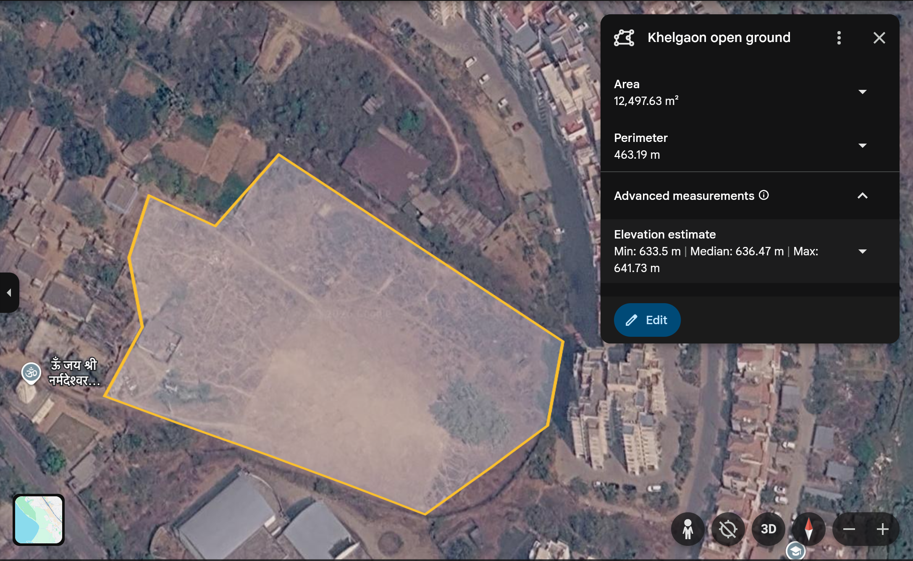

# Geospatial File Measurement API

A FastAPI backend that reads KML or a ZIP containing one Shapefile, stores extracted features in SQLite, and returns horizontal area and length measurements. Polygon and MultiPolygon areas include holes; LineString and MultiLineString lengths include all parts. Points require no measurement. Unsupported and invalid geometries produce feature-level results so valid siblings can still be processed.

## Setup

Python 3.11+ is required. Local installation and tests were run with Python 3.13.3 on macOS ARM64. The geospatial libraries installed from wheels; GDAL is not required.

```sh
python3 -m venv .venv
source .venv/bin/activate
python -m pip install -r requirements-dev.txt
uvicorn app.main:app --host 127.0.0.1 --port 8000
```

Interactive API documentation: <http://127.0.0.1:8000/docs>. OpenAPI schema: `/openapi.json`.

```sh
ruff check .
pytest -q
```

Runtime-only installation uses `requirements.txt`. `requirements-lock.txt` records the exact local development dependency versions; install it for the tested dependency set. There is no fresh-clone or Docker execution claim. CI runs lint and tests on Python 3.13/Linux.

Environment variables (export them in your shell; `.env` is not automatically loaded):

| Variable | Default | Purpose |
| --- | --- | --- |
| `DATABASE_PATH` | `data.sqlite3` | Persistent SQLite file |
| `MAX_UPLOAD_BYTES` | `52428800` | Maximum file size, 50 MiB |
| `MAX_EXPANDED_BYTES` | `104857600` | Maximum total ZIP member size, 100 MiB |

The request body is bounded before multipart parsing at the file limit plus 1 MiB for multipart overhead. The uploaded file itself is checked through bounded reads. Archives allow at most 1,000 members. Processing still uses memory proportional to the bounded input and extracted features; these limits are not a concurrency or memory budget.

Optional Docker:

```sh
docker build -t geospatial-api .
docker run --rm -p 8000:8000 -v geospatial-data:/data geospatial-api
```

The container runs as an unprivileged user. The named volume retains SQLite records.

## API

### Upload — `POST /api/files/`

```sh
curl -sS -X POST http://127.0.0.1:8000/api/files/ \
  -F 'file=@examples/survey.kml'
```

Returns HTTP 201. This response was recorded using the included sample through TestClient; generated UUIDs change each run:

```json
{
  "id": "f0f5e3a5-5224-4b3e-aca6-801a168f8601",
  "filename": "survey.kml",
  "feature_count": 3,
  "crs": "EPSG:4326",
  "crs_assumed": false,
  "status": "COMPLETED",
  "error": null
}
```

For Shapefiles, ZIP `.shp`, `.shx`, `.dbf`, and `.prj` with matching stems, optionally inside a directory. `.cpg` supplies attribute encoding; otherwise UTF-8 is used. Only one `.shp` dataset is accepted. If `.prj` is missing, explicitly provide the correct source CRS:

```sh
curl -sS -X POST http://127.0.0.1:8000/api/files/ \
  -F 'file=@survey.zip' -F 'assume_crs=EPSG:32643'
```

`assume_crs` is used only when `.prj` is absent. An existing `.prj` remains authoritative. Missing or invalid CRS is rejected; WGS84 is never guessed for a Shapefile.

### File information — `GET /api/files/{id}/`

```sh
curl -sS http://127.0.0.1:8000/api/files/f0f5e3a5-5224-4b3e-aca6-801a168f8601/
```

Returns HTTP 200 with the same metadata object shown above. Unknown or malformed IDs return HTTP 404 with `{"detail":"File not found."}`.

### Measurements — `GET /api/files/{id}/measurements/`

```sh
curl -sS 'http://127.0.0.1:8000/api/files/f0f5e3a5-5224-4b3e-aca6-801a168f8601/measurements/?page=1&page_size=100&include_geometry=true'
```

The [complete recorded response](examples/responses.json) contains the original geometry and properties for each feature. Its summary is:

```json
{
  "measured": 2,
  "not_applicable": 1,
  "unsupported": 0,
  "failed": 0,
  "total_area_m2": 11575.57924440529,
  "total_length_m": 104.60522747965324
}
```

The polygon's recorded measurement is:

```json
{
  "type": "AREA",
  "value": 11575.57924440529,
  "unit": "m2",
  "projected_crs": "EPSG:32643",
  "method": "projected_utm"
}
```

Response fields: `file_id`, `total`, `page`, `page_size`, `summary`, and `features`. Each feature has `index`, `feature_id`, `geometry_type`, `geometry`, `crs`, `properties`, `status`, `measurement`, `reason`, `warnings`, and `is_valid`. Geometry is a GeoJSON-like mapping in its **original source CRS**, which is not necessarily standard RFC 7946 WGS84 GeoJSON. Source indexes are zero-based and ordered consistently. KML IDs are preserved when supplied; otherwise IDs use the source index.

Pagination starts at 1, defaults to 100 features, and permits at most 1,000 per page. Summary values cover the entire file regardless of pagination. `include_geometry=false` sets each geometry to `null`. Pages beyond the last page return an empty feature list.

| Feature status | Meaning |
| --- | --- |
| `MEASURED` | Area or length calculated in projected metres |
| `NOT_APPLICABLE` | Point or MultiPoint |
| `UNSUPPORTED` | Missing, empty, mixed collection, unsupported type or outside local projection limits |
| `FAILED` | Invalid polygon, malformed feature or transformation failure |

Every non-measured feature includes a reason. Invalid polygons retain their geometry and validity explanation; they are not repaired automatically. Malformed geometry that cannot be constructed has a null geometry.

### Errors

Errors use a `detail` field. Request validation errors use FastAPI's standard detail array.

| HTTP status | Example |
| --- | --- |
| 404 | `{"detail":"File not found."}` |
| 413 | `{"detail":"Upload exceeds size limit."}` |
| 415 | `{"detail":"Upload a .kml or .zip Shapefile."}` |
| 422 | `{"detail":"Missing .prj; supply assume_crs explicitly."}` |
| 422 | `{"detail":"Malformed or unsafe KML XML."}` |
| 500 | `{"detail":{"message":"Internal processing failure.","file_id":"..."}}` |

Rejected uploads are not stored. After extraction succeeds, an internal processing failure is logged and a `FAILED` record is persisted when storage is available. Its `file_id` can be queried. `COMPLETED` means the file was processed; individual features may still have failed or unsupported results.

## Architecture

```text
app/
  main.py           response models, routes, processing coordination and SQLite
  readers.py        KML and Shapefile extraction, ZIP validation, JSON sanitization
  measurements.py   geometry validation and pure CRS/measurement functions
  limits.py         request-body limit before multipart parsing
tests/              isolated geometry and API tests
examples/           sample KML and actual recorded responses
```

The upload route reads bounded chunks and delegates CPU/file processing to a threadpool. The reader validates contents and returns source features and CRS. Each geometry is validated and measured independently. Metadata, summaries and features commit in one SQLite transaction, so a completed file has consistent counts and records. SQLite uses parameterized SQL and a composite `(file_id, source_index)` primary key for ordering and pagination.

Metadata, original feature geometry, attributes and results remain in SQLite. Original uploads are discarded after processing; ZIP members are read in memory and never extracted to the filesystem. There is no background worker or upload retention directory.

## CRS handling

Latitude/longitude degrees cannot be treated as metres. KML uses EPSG:4326; Shapefiles use their `.prj` or an explicit override. Every measurable feature is transformed to WGS84 using `always_xy=True`, then to the UTM zone selected from its WGS84 centroid. Northern zones use EPSG:326xx; southern zones use EPSG:327xx. This same strategy handles projected sources, including feet, without assuming their numeric coordinates are metres.

Measurement is horizontal and ignores Z coordinates. Polygon holes are excluded and multipart measures are summed. The successful result includes the projected CRS so the calculation is inspectable. CRS names use pyproj's authority string when available, otherwise its normalized representation; no EPSG identifier is invented.

A conservative local-geometry limit rejects features extending more than 6 degrees in latitude or longitude, outside 80°S–84°N, or across the antimeridian. Centroid-based UTM can cover adjacent zones and still incurs projection distortion. These values are projected planar approximations, not survey guarantees. Web Mercator (EPSG:3857) is not selected because its scale changes strongly with latitude.

The following values were calculated locally for 0.01° × 0.01° polygons at longitude 75° using pyproj/Shapely. The independent WGS84 geodesic reference was checked during development; it is not an API response field.

| Latitude | Projected area (m²) | Geodesic area (m²) |
| --- | ---: | ---: |
| 0° | 1,229,922.686 | 1,230,907.205 |
| 60°N | 621,090.071 | 621,587.241 |

The projected/reference discrepancy was about 0.08% in these two examples. It is not a general accuracy bound.

## Design decisions

- **FastAPI** provides multipart handling, response validation and generated OpenAPI documentation with little scaffolding.
- **SQLite and standard-library SQL** keep setup simple for three endpoints. Separate feature rows support pagination without loading the whole file on GET. SQLAlchemy would be useful if the schema or database choices expand.
- **PyShp plus defusedxml** avoids GDAL installation and KML-driver availability differences. The KML reader handles folders, placemarks, polygon holes, basic multipart geometry, name/description and ExtendedData. It is deliberately not a full KML renderer.
- **Synchronous processing** makes upload results immediately available for bounded files. A worker queue would help long uploads, but adds operational dependencies.
- **One UTM strategy** avoids trusting unsuitable metric source projections and unifies unit handling. Equal-area or polar projections and geodesic calculations would extend the supported range.
- **Explicit invalidity** keeps incorrect geometry visible rather than silently changing the submitted shape.
- **Safe inputs**: XML DTDs/entities are forbidden; ZIP traversal, absolute paths, symlinks, duplicates and excessive expansion/member counts are rejected. Extension alone is insufficient: the contents must parse as the advertised format.

## Validation

Tests generate Shapefiles and KML locally with temporary databases, with no network requirement. A synthetic 1,000 × 1,000 metre square in EPSG:32643 is transformed to WGS84 and uploaded as KML; the area must match 1,000,000 m² at a relative tolerance of `1e-7`. This tight tolerance checks the transformation round trip into the same UTM zone; it does not claim that all real-world measurements have that accuracy. Tests also check known length, holes, multipart sums, southern UTM, feet, invalid shapes, malformed input, upload limits, pagination and persistence.

A polygon named **Khelgaon open ground**, in Ranchi, was drawn in Google Earth Web, exported as KML and manually uploaded through the API's Swagger interface. The comparison below uses Google Earth's displayed area from the measurement screenshot and the API response for that exported polygon.



| Shape | Google Earth area | API area | Absolute difference | Difference |
| --- | ---: | ---: | ---: | ---: |
| Khelgaon open ground | 12,497.63 m² | 12,466.40 m² | 31.23 m² | 0.2499% |

Percentage difference is `abs(api - Google Earth) / Google Earth * 100`, calculated using the unrounded API value of 12,466.403678698167 m². The API selected EPSG:32645 (UTM zone 45N) and reported a valid Polygon. An independent WGS84 geodesic calculation using the returned coordinates gave 12,468.07 m², approximately 0.0134% different from the projected API result. The cause of the remaining difference from Google Earth's displayed value has not been established.

This is a comparison for one manually traced shape, not a surveyed boundary or a general accuracy guarantee. Google Earth's displayed perimeter was 463.19 m; polygon perimeter is not returned by this API and was not compared. A real Google Earth path comparison has not been performed; length is covered by the automated known-value tests.

## Limitations

No authentication, spatial queries, queue, global/polar measurement support, geodesic diagnostics, or KMZ support. KML network links, gx:Track, models and styling are not resolved; non-geometry placemarks receive unsupported results. Altitude and terrain distance are ignored. Empty datasets are rejected. Feature geometry is retained as read where it can be constructed; arbitrary KML markup is not retained. Large/concurrent files can still consume significant memory and CPU. A deployment should add concurrency controls appropriate to its environment.

## Learning

The main lesson from this project is that a measurement needs context: a number can look reasonable and still be wrong if the coordinates are in degrees or the wrong projection is used. The same-sized rectangle in latitude and longitude covers different areas at different latitudes, which makes CRS handling part of the calculation itself. File handling also goes beyond checking the extension—a Shapefile needs matching components and a known CRS, while a ZIP needs checks before its contents are read. Invalid geometry should stay visible with a useful explanation, so one bad feature does not hide the results for the rest of the file. The known-size square and line tests provide a concrete way to check the calculations instead of relying on whether the output looks plausible.

## Future scope

- Add an upload worker and a polling status endpoint for files that take too long for a synchronous request.
- Add polar/equal-area strategies and independent geodesic checks for a wider geographic range.
- Add PostGIS if users need spatial filtering or queries across uploaded datasets.
- Add authentication and per-user resource limits before exposing uploads to multiple users.
- Add retention/deletion endpoints when long-term storage requirements are known.
